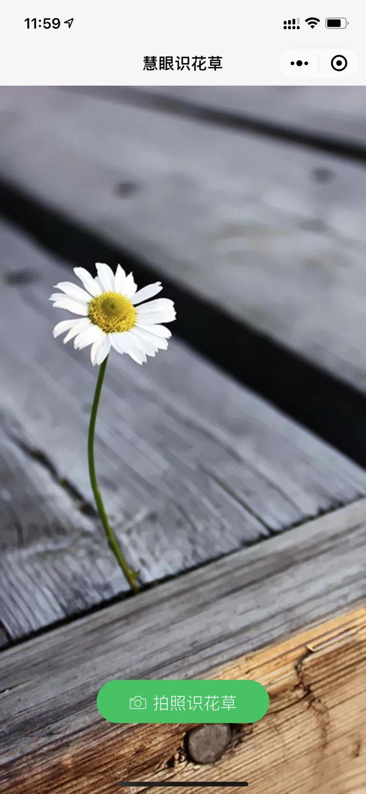
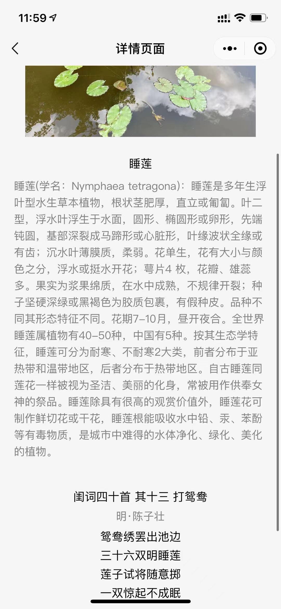

# 云开发应用-慧眼识花草-有福气的团队

## 队伍名称
有福气的团队
## 队伍成员
[Qingfu Wen](https://github.com/wenqf11)

## 作品介绍
一个自动识别植物名称的小程序，通过拍照或者从相册上传植物图片，可以识别植物名称。点击识别结果后，有可能（取决于接口是否支持）可以看到植物的详细介绍和匹配的古诗一首。并且支持将详情页面转发给微信好友和微信群。

## 模块介绍
-  图片上传与识别结果模块，从手机拍照或者相册上传一张植物图片提交，返回多个可能识别结果。用户可以滑动滑块查看不同识别结果

- 点击查看更多，可以跳转到详情页面。该页面会介绍植物的详细信息以及对应的匹配古诗一首，用户可以分享当前详情页面给微信好友和微信群。

## 作品体验

## 参考文档
[云开发文档](https://developers.weixin.qq.com/miniprogram/dev/wxcloud/basis/getting-started.html)

